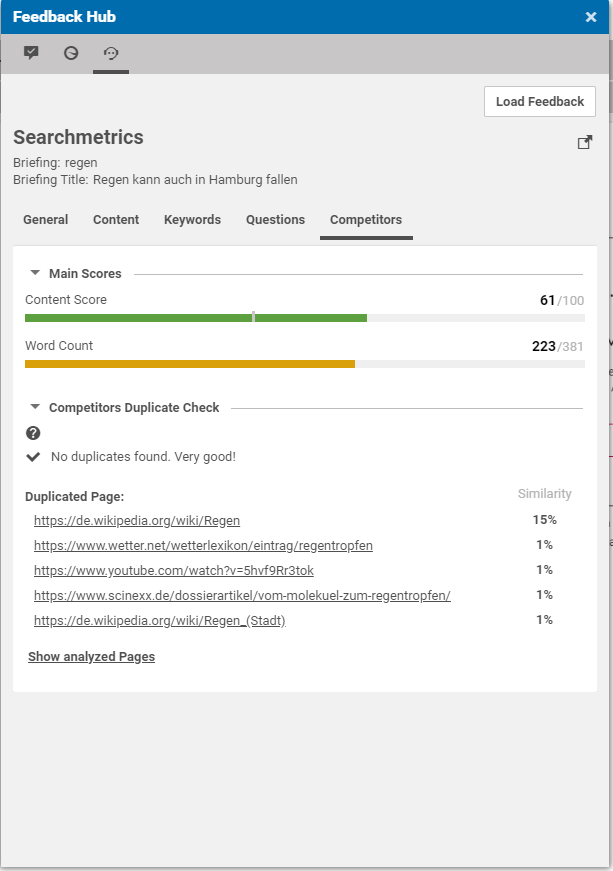

# Searchmetrics Adapter for Feedback Hub 

## Overview 

This is an integration for the SEO and content marketing platform __Searchmetrics__ (https://www.searchmetrics.com/).

The Feedback Hub Adapter 'Searchmetrics' is implemented as a Blueprint extension.

We usually only work on the latest CoreMedia version, so the latest version of the documentation and demo content 
may be on the latest version branch.

## Versioning

To find out which CoreMedia versions are supported by this project, 
please take look at the releases section or on the existing branches. 
To find the matching version of your CoreMedia system, please checkout the branch 
with the corresponding name. For example, 
if your CoreMedia version is 2104.1, checkout the branch 2104.1.

## Project Setup

### Configuration

For Configuration Details see section **[Configuration](Configuration.md)**.

### Screenshots

##### Overall Scoring Overview

##### Keyword Scoring 

##### Content Questions

##### Competitors Overview

### Issue Tracker

https://github.com/CoreMedia/feedback-hub-adapter-searchmetrics/issues

