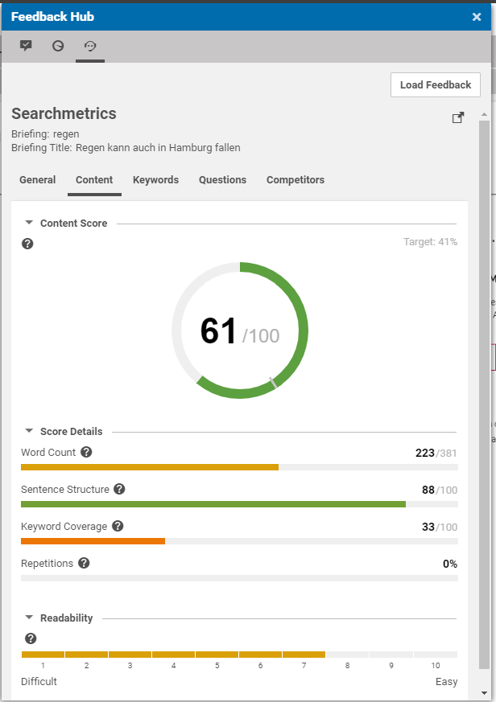
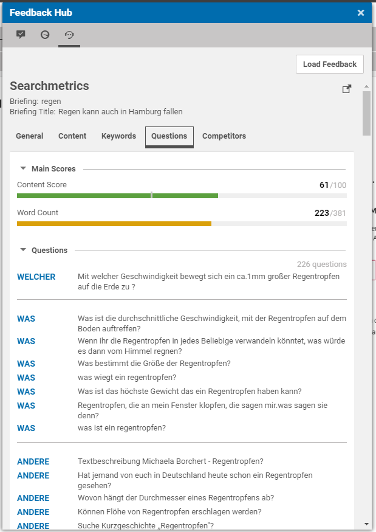

# Searchmetrics Adapter for Feedback Hub 

## Overview 

This is an integration for the SEO and content marketing platform __Searchmetrics__ (https://www.searchmetrics.com/).

The Feedback Hub Adapter 'Searchmetrics' is implemented as a Blueprint plugin.

We usually only work on the latest CoreMedia version, so the latest version of the documentation and demo content 
may be on the latest version branch.

## Versioning

To find out which CoreMedia versions are supported by this project, 
please take look at the releases section or on the existing branches.

## Project Setup

### Configuration

For Configuration Details see section **[Configuration](Configuration.md)**.

### Screenshots

##### Overall Scoring Overview

##### Keyword Scoring 

##### Content Questions

##### Competitors Overview

### Issue Tracker

https://github.com/CoreMedia/feedback-hub-adapter-searchmetrics/issues

## CoreMedia Labs

Welcome to [CoreMedia Labs](https://blog.coremedia.com/labs/)! This repository
is part of a platform for developers who want to have a look under the hood or
get some hands-on understanding of the vast and compelling capabilities of
CoreMedia. Whatever your experience level with CoreMedia is, we've got something
for you.

Each project in our Labs platform is an extra feature to be used with CoreMedia,
including extensions, tools and 3rd party integrations. We provide some test
data and explanatory videos for non-customers and for insiders there is
open-source code and instructions on integrating the feature into your
CoreMedia workspace. 

The code we provide is meant to be example code, illustrating a set of features
that could be used to enhance your CoreMedia experience. We'd love to hear your
feedback on use-cases and further developments! If you're having problems with
our code, please refer to our issues section. If you already have a solution to 
an issue, we love to review and integrate your pull requests. 