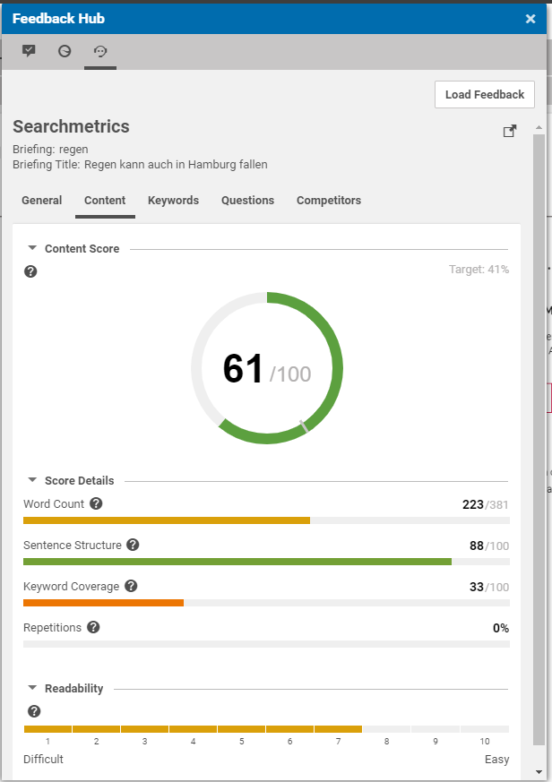
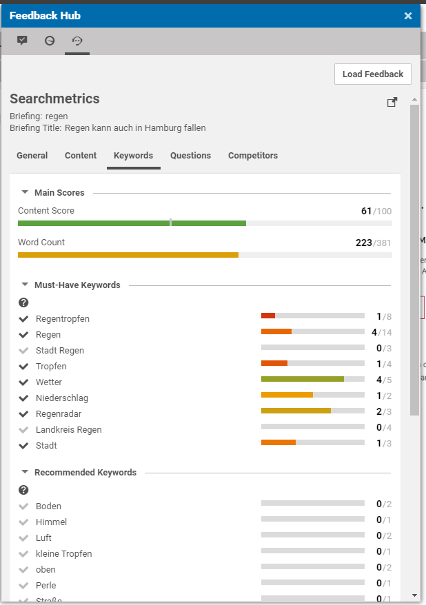
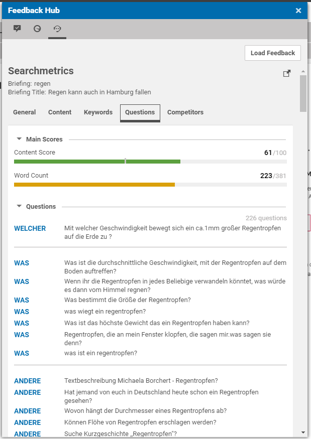
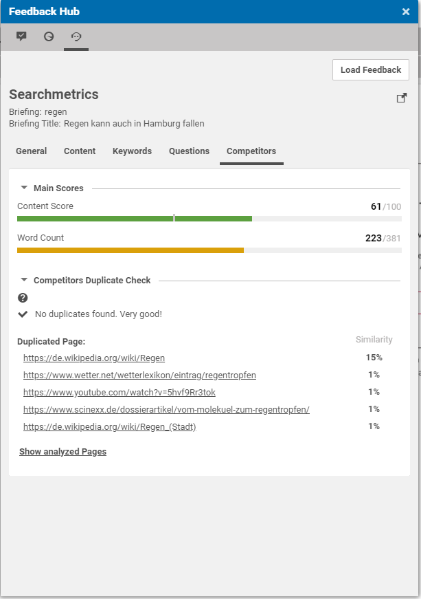

# Searchmetrics Feedback Hub Adapter

## Index

* [Installation](https://github.com/CoreMedia/feedback-hub-adapter-searchmetrics/blob/master/README.md)
* [Configuration](https://github.com/CoreMedia/feedback-hub-adapter-searchmetrics/blob/master/documentation/Configuration.md)

## Abstract

The Searchmetrics Feedback Hub Adapter integrates Searchmetrics briefings into the CoreMedia Feedback Hub.

### Overall Scoring Overview

### Keyword Scoring 

### Content Questions

### Competitors Overview

## CoreMedia Labs Prototypes

This is a CoreMedia Labs prototype which means it __does not provide a stable API__.
The current implementation won't match the one which will be released for a future CoreMedia workspace.
Therefore, we also don't provide a proper documentation for it.
If you are interested in a custom integration, feel free to contact us!

## Versioning

The release versions of the Searchmetrics Feedback Hub Adapter is matching the version of CoreMedia workspace releases.
E.g. when the CoreMedia workspace has the version __2001.1__, the matching Searchmetrics Feedback Hub Adapter release will have
version __2001.1-X__ where 'X' indicates the release version of the Searchmetrics Feedback Hub Adapter.

